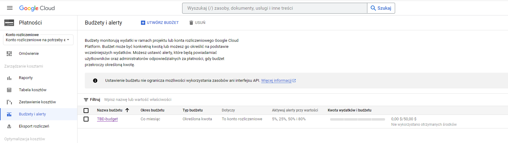
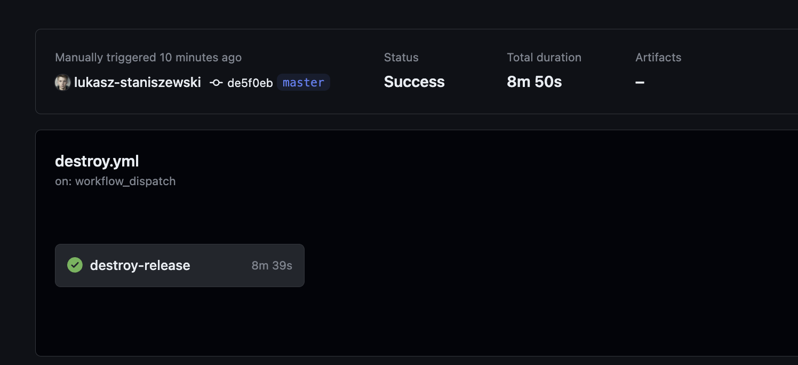
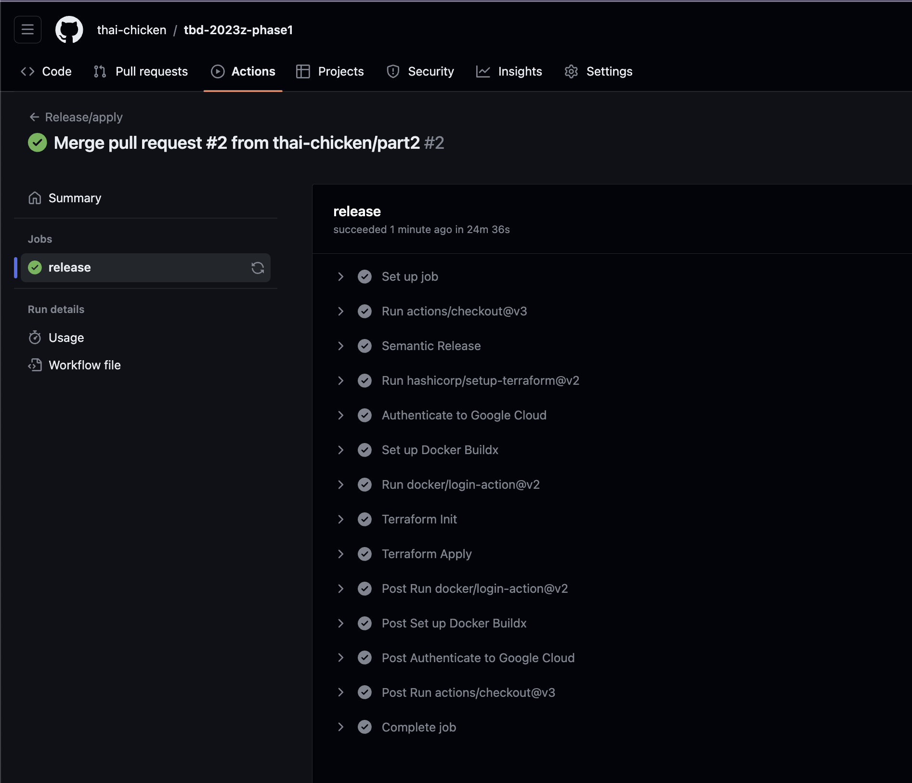
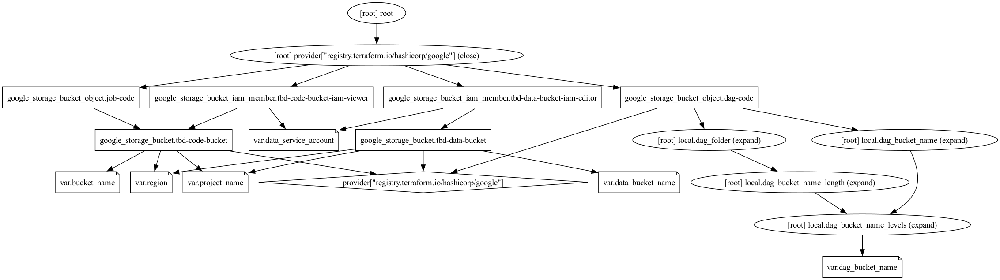
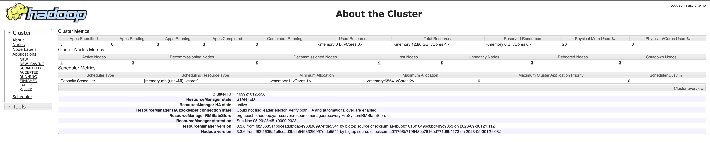
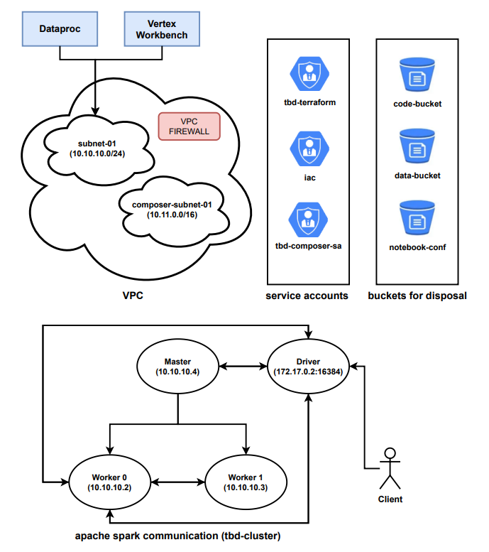
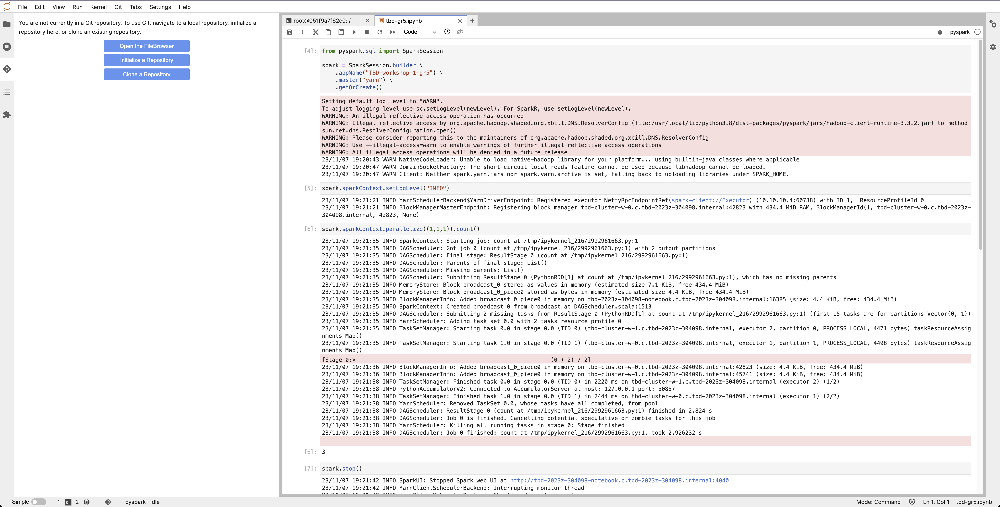
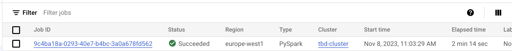
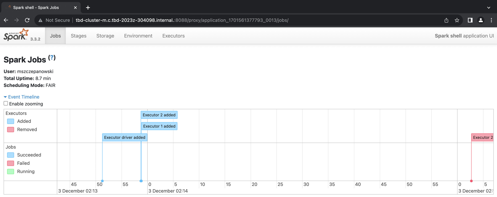

## 1. Authors

### 1.1. Team

- Łukasz Staniszewski
- Mateusz Szczepanowski
- Albert Ściseł

### 1.2. Info

- Group number: 5
- Forked repo link: <https://github.com/thai-chicken/tbd-2023z-phase1>

## 2. Fork [base repo](https://github.com/bdg-tbd/tbd-2023z-phase1) and follow all steps in README.md

## 3. Set budget alerts on 5%, 25%, 50%, 80% of 50$

<u>Screen:</u>
  
  

## 4. From avaialble Github Actions select and run destroy on main branch

<u>Screen:</u>  

  

## 5. Create new git branch and add two resources in ```/modules/data-pipeline/main.tf```

```
- resource "google_storage_bucket" "tbd-data-bucket" -> the bucket to store data. Set the following properties:
  - project  // look for variable in variables.tf
  - name  // look for variable in variables.tf
  - location // look for variable in variables.tf
  - uniform_bucket_level_access = false #tfsec:ignore:google-storage-enable-ubla
     force_destroy               = true
  - public_access_prevention    = "enforced"
  - if checkcov returns error, add other properties if needed

- resource "google_storage_bucket_iam_member" "tbd-data-bucket-iam-editor" -> assign role storage.objectUser to data service account. Set the following properties:
  - bucket // refere to bucket name from tbd-data-bucket
  - role   // follow the instruction above
  - member = "serviceAccount:${var.data_service_account}"
```

<u>Link to the modified file</u>: <https://github.com/thai-chicken/tbd-2023z-phase1/blob/master/modules/data-pipeline/main.tf>

<u>Snippet</u>:

```python

resource "google_storage_bucket" "tbd-data-bucket" {
    project                     = var.project_name
    name                        = var.data_bucket_name
    location                    = var.region
    uniform_bucket_level_access = false #tfsec:ignore:google-storage-enable-ubla
    force_destroy               = true
    public_access_prevention    = "enforced"

    #checkov:skip=CKV_GCP_29: "Ensure that Cloud Storage buckets have uniform bucket-level access enabled"
    #checkov:skip=CKV_GCP_62: "Bucket should log access"
    #checkov:skip=CKV_GCP_78: "Ensure Cloud storage has versioning enabled"
}

resource "google_storage_bucket_iam_member" "tbd-data-bucket-iam-editor" {
    bucket = google_storage_bucket.tbd-data-bucket.name
    role   = "roles/storage.objectUser"
    member = "serviceAccount:${var.data_service_account}"
}
```


### Task: 
```
> Create PR from this branch to **YOUR** master and merge it to make new release, place the screenshot from GA after succesfull application of release with this changes.
```

<u>Screenshot of the release</u>



## 6. Analyze terraform code. Play with terraform plan, terraform graph to investigate different modules

```
> Describe one selected module and put the output of terraform graph for this module here
```

<u>Chosen module</u>: ```/modules/data-pipeline```

The Terraform module **/modules/data-pipeline/main.tf** presented here defines resources for managing Google Cloud Storage (GCS) buckets and objects within those buckets.

##### Locals Block

The locals block is used to define local variables for reuse throughout the module, which makes the configuration more maintainable and readable.

##### Google Storage Bucket

The google_storage_bucket named tbd-code-bucket defines a GCS bucket. The bucket has public_access_prevention set to enforced, which prevents public access to the bucket.

##### Google Storage Bucket IAM Member Resource

The google_storage_bucket_iam_member resource named tbd-code-bucket-iam-viewer assigns the roles/storage.objectViewer role to a service account specified by var.data_service_account for the bucket defined earlier. This IAM role allows the service account to view objects in the bucket.

##### Google Storage Bucket Object Resources

There are two google_storage_bucket_object resources defined, job-code and dag-code. Each resource is responsible for creating objects (files) within the GCS buckets.

<u>Fragment of plan command output</u>:

This command creates an execution plan - it determines what actions are necessary to accomplish the set goal defined in the Terraform files. Can help prevent unwanted changes (what to add, what to change and what to destroy).

```bash
~/.../tbd-2023z-phase1/modules/data-pipeline$ terraform plan

var.bucket_name
  Bucket for storing data pipeline additional code
  Enter a value: code_bucket

var.dag_bucket_name
  Apache Airflow bucket for storing DAGs
  Enter a value: dag_bucket

var.data_bucket_name
  Apache Airflow bucket for storing and processing data
  Enter a value: data_bucket

var.data_service_account
  Service account with READER role to the bucket storing code
  Enter a value: read_code_bucket

var.project_name
  Project name
  Enter a value: tbd_plan

Terraform used the selected providers to generate the following execution plan. Resource actions are indicated with the following symbols:
  + create

Terraform will perform the following actions:

  ...

  + resource "google_storage_bucket_object" "job-code" {
      + bucket         = "code_bucket"
      + content        = (sensitive value)
      + content_type   = (known after apply)
      + crc32c         = (known after apply)
      + detect_md5hash = "different hash"
      + id             = (known after apply)
      + kms_key_name   = (known after apply)
      + md5hash        = (known after apply)
      + media_link     = (known after apply)
      + name           = "spark-job.py"
      + output_name    = (known after apply)
      + self_link      = (known after apply)
      + source         = "./resources/spark-job.py"
      + storage_class  = (known after apply)
    }

Plan: 6 to add, 0 to change, 0 to destroy.
```

<u> Screenshot of terraform graph output </u>:

This command generates visual representations of an execution plan. Edges on the graph show dependencies between resources. The graph is in DOT format and can be rendered with tools such as Graphviz.



## 7. Reach YARN UI

```
> place the port and the screenshot of YARN UI here
```

SSH tunnel is created using local port 1080 and in Chrome we can connect through the proxy with port **8088** using link:

<http://tbd-cluster-m:8088/cluster>



## 8. Draw an architecture diagram (e.g. in draw.io)

```
> Diagram should include:
- VPC topology with service assignment to subnets
- Description of the components of service accounts
- List of buckets for disposal
- Description of network communication (ports, why it is necessary to specify the host for the driver) of Apache Spark running from Vertex AI Workbech
```

<u>Components of service accounts</u>:

A Service Account is a special type of account used by an application or a service (to act on its behalf) to make authorized API calls. This account is not intended for direct user access but is associated with the application or service. Our project uses the following service accounts:

1. **Terraform Service Account (Terraform SA)** - used to authenticate and authorize Terraform to manage resources on a cloud provider platform. It allows Terraform to create, update, and delete resources.
2. **Google Cloud Composer Service Account (Composer SA)** - used by Google Cloud Composer to access various Google Cloud resources such as Google Cloud Storage, BigQuery, etc. It is necessary for executing and managing workflows that interact with these services.
3. **Infrastructure as Code Service Account (IaC SA)** - used by IaC tools to automate the provisioning and configuration of infrastructure. In GitHub Actions, we use IaC SA to authenticate and execute actions such as deploying infrastructure when a pull request is merged.

<u>Network communication</u>:

Specifying the host for the driver is essential for a few key reasons:
1. Resource Allocation: The driver needs to communicate with the master to allocate resources across worker nodes. Specifying the host ensures the driver is reachable for this coordination.
2. Task Distribution and Management: The driver divides the application into tasks and schedules them on workers. Knowing the driver's host helps manage this distribution effectively.
3. Fault Tolerance: In case of failures, the system needs to know the driver's location to restart or move tasks, ensuring resilience and continuity of operations.
4. Data Flow Optimization: For efficient data transfer between the nodes, the network topology must be known, which includes the driver's location.

<u>Diagram</u>:



## 9. Add costs by entering the expected consumption into Infracost

We used `infracost-usage.yml` file to define the expected consumption. The file is located in the root directory of the project. Content (note: the values are only for example purposes):

```yaml
version: 0.1

resource_usage:
  #  The following usage values apply to individual resources and override any value defined in the resource_type_default_usage section.
  # All values are commented-out, you can uncomment resources and customize as needed.
  #
  module.vpc.module.cloud-router.google_compute_router_nat.nats["nat-gateway"]:
    assigned_vms: 1 # Number of VM instances assigned to the NAT gateway
    monthly_data_processed_gb: 2.0 # Monthly data processed (ingress and egress) by the NAT gateway in GB
  module.data-pipelines.google_storage_bucket.tbd-code-bucket:
    storage_gb: 2.0 # Total size of bucket in GB.
    monthly_class_a_operations: 10 # Monthly number of class A operations (object adds, bucket/object list).
    monthly_class_b_operations: 25 # Monthly number of class B operations (object gets, retrieve bucket/object metadata).
    monthly_data_retrieval_gb: 4.0 # Monthly amount of data retrieved in GB.
    monthly_egress_data_transfer_gb:
      same_continent: 2.0 # Same continent.
      worldwide: 3.0 # Worldwide excluding Asia, Australia.
      asia: 0.0 # Asia excluding China, but including Hong Kong.
      china: 0.0 # China excluding Hong Kong.
      australia: 0.0 # Australia.
  module.data-pipelines.google_storage_bucket.tbd-data-bucket:
    storage_gb: 5.0 # Total size of bucket in GB.
    monthly_class_a_operations: 10 # Monthly number of class A operations (object adds, bucket/object list).
    monthly_class_b_operations: 25 # Monthly number of class B operations (object gets, retrieve bucket/object metadata).
    monthly_data_retrieval_gb: 10.0 # Monthly amount of data retrieved in GB.
    monthly_egress_data_transfer_gb:
      same_continent: 4.0 # Same continent.
      worldwide: 5.0 # Worldwide excluding Asia, Australia.
      asia: 0.0 # Asia excluding China, but including Hong Kong.
      china: 0.0 # China excluding Hong Kong.
      australia: 0.0 # Australia.
  module.gcr.google_container_registry.registry:
    storage_gb: 8.0 # Total size of bucket in GB.
    monthly_class_a_operations: 5 # Monthly number of class A operations (object adds, bucket/object list).
    monthly_class_b_operations: 10 # Monthly number of class B operations (object gets, retrieve bucket/object metadata).
    monthly_data_retrieval_gb: 12.0 # Monthly amount of data retrieved in GB.
    monthly_egress_data_transfer_gb:
      same_continent: 6.0 # Same continent.
      worldwide: 8.0 # Worldwide excluding Asia, Australia.
      asia: 0.0 # Asia excluding China, but including Hong Kong.
      china: 0.0 # China excluding Hong Kong.
      australia: 0.0 # Australia.
  module.vertex_ai_workbench.google_storage_bucket.notebook-conf-bucket:
    storage_gb: 4.0 # Total size of bucket in GB.
    monthly_class_a_operations: 8 # Monthly number of class A operations (object adds, bucket/object list).
    monthly_class_b_operations: 15 # Monthly number of class B operations (object gets, retrieve bucket/object metadata).
    monthly_data_retrieval_gb: 8.0 # Monthly amount of data retrieved in GB.
    monthly_egress_data_transfer_gb:
      same_continent: 4.0 # Same continent.
      worldwide: 6.0 # Worldwide excluding Asia, Australia.
      asia: 0.0 # Asia excluding China, but including Hong Kong.
      china: 0.0 # China excluding Hong Kong.
      australia: 0.0 # Australia.
```

Infracost output assuming usage above:

```
$ infracost breakdown --path . --usage-file infracost-usage.yml

Evaluating Terraform directory at .
  ✔ Downloading Terraform modules
  ✔ Evaluating Terraform directory
  ✔ Retrieving cloud prices to calculate costs

Project: thai-chicken/tbd-2023z-phase1

 Name                                                                                Monthly Qty  Unit             Monthly Cost

 module.data-pipelines.google_storage_bucket.tbd-code-bucket
 ├─ Storage (standard)                                                                         2  GiB                     $0.04
 ├─ Object adds, bucket/object list (class A)                                              0.001  10k operations          $0.00
 ├─ Object gets, retrieve bucket/object metadata (class B)                                0.0025  10k operations          $0.00
 └─ Network egress
    ├─ Data transfer in same continent                                                         2  GB                      $0.04
    ├─ Data transfer to worldwide excluding Asia, Australia (first 1TB)                        3  GB                      $0.36
    ├─ Data transfer to Asia excluding China, but including Hong Kong (first 1TB)  Monthly cost depends on usage: $0.12 per GB
    ├─ Data transfer to China excluding Hong Kong (first 1TB)                      Monthly cost depends on usage: $0.23 per GB
    └─ Data transfer to Australia (first 1TB)                                      Monthly cost depends on usage: $0.19 per GB

 module.data-pipelines.google_storage_bucket.tbd-data-bucket
 ├─ Storage (standard)                                                                         5  GiB                     $0.10
 ├─ Object adds, bucket/object list (class A)                                              0.001  10k operations          $0.00
 ├─ Object gets, retrieve bucket/object metadata (class B)                                0.0025  10k operations          $0.00
 └─ Network egress
    ├─ Data transfer in same continent                                                         4  GB                      $0.08
    ├─ Data transfer to worldwide excluding Asia, Australia (first 1TB)                        5  GB                      $0.60
    ├─ Data transfer to Asia excluding China, but including Hong Kong (first 1TB)  Monthly cost depends on usage: $0.12 per GB
    ├─ Data transfer to China excluding Hong Kong (first 1TB)                      Monthly cost depends on usage: $0.23 per GB
    └─ Data transfer to Australia (first 1TB)                                      Monthly cost depends on usage: $0.19 per GB

 module.gcr.google_container_registry.registry
 ├─ Storage (standard)                                                                         8  GiB                     $0.21
 ├─ Object adds, bucket/object list (class A)                                             0.0005  10k operations          $0.00
 ├─ Object gets, retrieve bucket/object metadata (class B)                                 0.001  10k operations          $0.00
 └─ Network egress
    ├─ Data transfer in same continent                                                         6  GB                      $0.12
    ├─ Data transfer to worldwide excluding Asia, Australia (first 1TB)                        8  GB                      $0.96
    ├─ Data transfer to Asia excluding China, but including Hong Kong (first 1TB)  Monthly cost depends on usage: $0.12 per GB
    ├─ Data transfer to China excluding Hong Kong (first 1TB)                      Monthly cost depends on usage: $0.23 per GB
    └─ Data transfer to Australia (first 1TB)                                      Monthly cost depends on usage: $0.19 per GB

 module.vertex_ai_workbench.google_storage_bucket.notebook-conf-bucket
 ├─ Storage (standard)                                                                         4  GiB                     $0.08
 ├─ Object adds, bucket/object list (class A)                                             0.0008  10k operations          $0.00
 ├─ Object gets, retrieve bucket/object metadata (class B)                                0.0015  10k operations          $0.00
 └─ Network egress
    ├─ Data transfer in same continent                                                         4  GB                      $0.08
    ├─ Data transfer to worldwide excluding Asia, Australia (first 1TB)                        6  GB                      $0.72
    ├─ Data transfer to Asia excluding China, but including Hong Kong (first 1TB)  Monthly cost depends on usage: $0.12 per GB
    ├─ Data transfer to China excluding Hong Kong (first 1TB)                      Monthly cost depends on usage: $0.23 per GB
    └─ Data transfer to Australia (first 1TB)                                      Monthly cost depends on usage: $0.19 per GB

 module.vpc.module.cloud-router.google_compute_router_nat.nats["nat-gateway"]
 ├─ Assigned VMs (first 32)                                                                  730  VM-hours                $1.02
 └─ Data processed                                                                             2  GB                      $0.09

 OVERALL TOTAL                                                                                                            $4.50
──────────────────────────────────
32 cloud resources were detected:
∙ 5 were estimated, all of which include usage-based costs, see https://infracost.io/usage-file
∙ 24 were free, rerun with --show-skipped to see details
∙ 3 are not supported yet, rerun with --show-skipped to see details

┏━━━━━━━━━━━━━━━━━━━━━━━━━━━━━━━━━━━━━━━━━━━━━━━━━━━━┳━━━━━━━━━━━━━━┓
┃ Project                                            ┃ Monthly cost ┃
┣━━━━━━━━━━━━━━━━━━━━━━━━━━━━━━━━━━━━━━━━━━━━━━━━━━━━╋━━━━━━━━━━━━━━┫
┃ thai-chicken/tbd-2023z-phase1                      ┃ $5           ┃
┗━━━━━━━━━━━━━━━━━━━━━━━━━━━━━━━━━━━━━━━━━━━━━━━━━━━━┻━━━━━━━━━━━━━━┛
```

## 10. Some resources are not supported by infracost yet. Estimate manually total costs of infrastructure based on pricing costs for region used in the project. Include costs of cloud composer, dataproc and AI vertex workbanch and them to infracost estimation

<u>Resources not supported by infracost yet (after running `--show-skipped`):</u>
- 1 x google_composer_environment - Cloud Composer
- 1 x google_dataproc_cluster - Dataproc
- 1 x google_notebooks_instance - Vertex AI Workbench

<u>Our summarized estimation:</u>

| Resource            | Monthly price |
|---------------------|--------------:|
| Dataproc            | $217.23       |
| Cloud Composer      | $419.64       |
| Vertex AI Workbench | $80.11        |
| Infracost           | $4.50         |
| **Total**           | **$721.48**   |


<u>References:</u>

| Name            | URL |
|---------------------|--------------:|
| Compute engine machines pricing            | <u>[[LINK]](https://cloud.google.com/compute/all-pricing#general_purpose)</u>       |
| Compute engine disks pricing            | <u>[[LINK]](https://cloud.google.com/compute/disks-image-pricing#disk)</u>       |
| Dataproc pricing            | <u>[[LINK]](https://cloud.google.com/dataproc/pricing#on_pricing)</u>       |
| Vertex AI pricing            | <u>[[LINK]](https://cloud.google.com/vertex-ai/pricing#user-managed-notebooks)</u>       |
| Cloud Composer pricing            | <u>[[LINK]](https://cloud.google.com/composer/pricing#composer-2-pricing)</u>       |
| **Our Google Cloud Pricing Calculator**  (without Vertex AI fee)         | <u>[[LINK]](https://cloud.google.com/products/calculator/#id=fd4edf2e-09d5-4f7c-b2d2-cdcb8446d74e)</u>   |

<u>Detailed estimation:</u>

**DISCLAIMER: We assumed that our infrastructure is running a whole month, which equals $730$ hours. Also, since our Cloud Composer's number of workers is scalable between $1$ and $3$, we chose $2$ as avarage number of workers.**

1. Cloud Composer

| Resource            | Name                       | Properties        | Price per unit | Number of units | Full monthly price |
|---------------------|----------------------------|-------------------|----------------|-----------------|-------------------:|
| Cloud Composer      | Environment fee               | Belgium, Small    |      $0.39 / hour          |         730.000 |    $284.70 |
| Cloud Composer      | Compute mCPU               | 730 hours x 0.50 x 5 (Scheduler, 2x Worker, Web Server, Triggerer) |         $0.05 / mCPU hour       |           1,825.00 |     $91.25 |
| Cloud Composer      | Compute Memory             | 730 hours x 1,875.00 GiB x 5 (Scheduler, 2x Worker, Web Server, Triggerer)                |      $0.006 per GiB / hour         |       6,843.750 |     $41.06 |
| Cloud Composer      | Compute Storage            | 730 hours x 1 GiB x 5 (Scheduler, 2x Worker, Web Server, Triggerer)                |         $0.0002 per GiB / hour      |       3,650.000 |      $0.73 |
| Cloud Composer      | Database Storage           | 10 GiB is minimum for Database Storage                |      $0.19 per GiB / month          |          10.000 |      $1.90 |
| --      | --                        | --    | -- | -- |    **$419.64** |

2. Dataproc

| Resource            | Name                       | Properties        | Price per unit | Number of units | Full monthly price |
|---------------------|----------------------------|-------------------|----------------|-----------------|-----------:|
| Dataproc            | Compute Engine (master) | 1x e2-standard-2     | $0.0737 / hour        | 730.00   |     $53.81 |
| Dataproc            | Compute Engine (worker) | 2x e2-standard-2     | $0.0737 / hour | 1460.00 |            $107.62 |
| Dataproc            | DataProc Service        | 730 hours x 2 vCPUs x 3 engines   | $0.010 per vCPU / hour |     4380.00            |     $43.80 |
| Dataproc            | Persistent Disk         | Zonal standard PD, 100 GiB x 3 engines |        $0.04 per GB / month        |         300.000 |     $12.00 |
| --                  | --                      | --                | -- | -- |    **$217.23** |


3. Vertex AI Workbench


| Resource            | Name                       | Properties        | Price per unit | Number of units | Full monthly price |
|---------------------|----------------------------|-------------------|----------------|-----------------|-----------:|
| Vertex AI Workbench | Compute Engine (Instance)            | 1x e2-standard-2     | $0.0737 / hour        | 730.00   |     $53.81 |
| Vertex AI Workbench | Boot disk (Instance)   | Zonal balanced PD, 150 GiB | $0.10 per GiB / month |         150.000 |      $15.00 |
| Vertex AI Workbench | Additional disk (Instance) | Zonal standard PD, 100 GiB |        $0.04 per GB / month        |         100.000 |     $4.00 |
| Vertex AI Workbench | Management fee (User-managed notebooks)             | 730 hours x 2 vCPUs | $0.005 per vCPU / hour | $1460.00 |      $7.30 |
| -- | --                        | --    | -- | -- |     **$80.11** |


<u>Options for a cost optimization</u>

- **Reducing number of workers**: we could reduce the number of Airflow workers to only one in Cloud composer or use only one worker in Dataproc.
- **Preemptible/spot VMs**: we could use preemptible VMs for Dataproc and Vertex AI Workbench, which are cheaper than standard workers, but can be terminated at any time.
- **Cheaper machine types**: we could use more relevant to requirements machine types in Dataproc and Vertex AI Workbench.
- **Long-term commitment**: we could commit to a long-term contract with Google Cloud, which would give us a discount on the services used.
- **Deleting resources**: we could delete resources that are not used and only invoke them when needed, especially since we use Terraform.
- **Move to another region**: we could move our infrastructure to another region, where the prices are lower.

## 11. Create a BigQuery dataset and an external table

We used `.orc` file that has been generated in our bucket while doing the 13th task.

```bash
> bq mk tbd_dataset_11
Dataset 'tbd-2023z:tbd_dataset_11' successfully created.

> bq mk --table --external_table_definition=@ORC=gs://tbd-2023z-304098-data/data/shakespeare/part-00000-445fbfc0-ae6e-4b8a-989f-de87ce8fc6c5-c000.snappy.orc tbd_dataset_11.tbd_table
Table 'tbd-2023z:tbd_dataset_11.tbd_table' successfully created.

> bq show --schema --format=prettyjson tbd-2023z:tbd_dataset_11.tbd_table
[
  {
    "mode": "NULLABLE",
    "name": "word",
    "type": "STRING"
  },
  {
    "mode": "NULLABLE",
    "name": "sum_word_count",
    "type": "INTEGER"
  }
]

```

```
> why does ORC not require a table schema?
```
Since ORC files add table schema in the file footer, it's unnecessary to specify the schema while creating a table in BigQuery since BigQuery can directly read the schema from the ORC file. The metadata in an ORC file includes information such as (i.a.):

- The number of rows in the file
- Column schema
- File-level statistics
This essentially allows BigQuery to derive the needed table schema directly from the ORC file, eliminating the need to separately define it.

## 12. Start an interactive session from Vertex AI workbench (steps 7-9 in README)

<u>Screenshot of notebook</u>:



## 13. Find and correct the error in spark-job.py
<u> Error cause</u>: the reason why the spark job did not work was the given name of the bucket in which the data processed by the job should be stored. The solution was to change this name to the name of our bucket in one of the lines in the code of the spark-job.py file.

<u> How to find an error </u>: in the dataproc jobs logs, where we found out that out spark job fails, we looked into the error message and there was such a log fragment:

```bash
{
  "code" : 404,
  "errors" : [ {
    "domain" : "global",
    "message" : "The specified bucket does not exist.",
    "reason" : "notFound"
  } ],
  "message" : "The specified bucket does not exist."
}
```

<u>Corrected code</u> in `spark-job.py`:

```

# change to your data bucket
DATA_BUCKET = "gs://tbd-2023z-304098-data/data/shakespeare/"

```

After that, <u>the job passed successfully</u> in the dataproc jobs logs:



Also, here are the <u>logs from the sumbition of the job</u>:

```bash
mszczepanowski@C15581 tbd-2023z-phase1 % gcloud dataproc jobs submit pyspark modules/data-pipeline/resources/spark-job.py --cluster=tbd-cluster --region=europe-west1
Job [05fab19412154cfd84ec9a5d666c5302] submitted.

...

The top words in shakespeare are
+----+--------------+
|word|sum_word_count|
+----+--------------+
| the|         25568|
|   I|         21028|
| and|         19649|
|  to|         17361|
|  of|         16438|
|   a|         13409|
| you|         12527|
|  my|         11291|
|  in|         10589|
|  is|          8735|
|that|          8561|
| not|          8395|
|  me|          8030|
| And|          7780|
|with|          7224|
|  it|          7137|
| his|          6811|
|  be|          6724|
|your|          6244|
| for|          6154|
+----+--------------+
only showing top 20 rows

...

jobUuid: b077d36a-fb62-3972-883a-e0182b98541f
placement:
  clusterName: tbd-cluster
  clusterUuid: 328d2fb5-dafb-401b-af06-f7250ab9b3f5
pysparkJob:
  mainPythonFileUri: gs://dataproc-staging-europe-west1-519557031031-7e61v90i/google-cloud-dataproc-metainfo/328d2fb5-dafb-401b-af06-f7250ab9b3f5/jobs/05fab19412154cfd84ec9a5d666c5302/staging/spark-job.py
reference:
  jobId: 05fab19412154cfd84ec9a5d666c5302
  projectId: tbd-2023z-304098
status:
  state: DONE
  stateStartTime: '2023-11-16T20:32:09.528879Z'
statusHistory:
- state: PENDING
  stateStartTime: '2023-11-16T20:30:05.012613Z'
- state: SETUP_DONE
  stateStartTime: '2023-11-16T20:30:05.053908Z'
- details: Agent reported job success
  state: RUNNING
  stateStartTime: '2023-11-16T20:30:05.294453Z'
yarnApplications:
- name: Shakespeare WordCount
  progress: 1.0
  state: FINISHED
  trackingUrl: http://tbd-cluster-m.c.tbd-2023z-304098.internal.:8088/proxy/application_1700160019211_0005/
```

## 14. Additional tasks using Terraform
```
>> 1. Add support for arbitrary machine types and worker nodes for a Dataproc cluster and JupyterLab instance
```

- We had to change `main.tf`, and `variable.tf` files in the root directory, in the `dataproc` module and in the `vertex-ai-workbench` module.

- In the `dataproc` module we added a new variable `num_workers` in the [`modules/dataproc/variables.tf`](modules/dataproc/variables.tf), which represents number of worker nodes and is set default to 2:

  ```tf
  variable "num_workers" {
    type        = number
    default     = 2
    description = "Number of worker nodes"
  }
  ```

  Also, we had to include this variable in the [`modules/dataproc/main.tf`](modules/dataproc/main.tf) file, in the `worker_config` block:

  ```tf
  worker_config {
    num_instances = var.num_workers
    machine_type  = var.machine_type
    disk_config {
      boot_disk_type    = "pd-standard"
      boot_disk_size_gb = 100
    }
  }
  ```

- In the `vertex-ai-workbench` module we added a new variable `machine_type` in the [`modules/vertex-ai-workbench/variables.tf`](modules/vertex-ai-workbench/variables.tf), which represents machine type for notebook instance and is set default to "e2-standard-2":

  ```tf
  variable "machine_type" {
    type        = string
    default     = "e2-standard-2"
    description = "Machine type for notebook instance"
  }
  ```

  Also, in the [`modules/vertex-ai-workbench/main.tf`](modules/vertex-ai-workbench/main.tf) file, we had to include this variable:

  ```tf
  resource "google_notebooks_instance" "tbd_notebook" {
    #checkov:skip=CKV2_GCP_18: "Ensure GCP network defines a firewall and does not use the default firewall"
    depends_on   = [google_project_service.notebooks]
    location     = local.zone
    machine_type = var.machine_type
    name         = "${var.project_name}-notebook"
    ...
  }
  ```

- Finally, in the root directory, we added 3 new variables in the [`variables.tf`](variables.tf) file:

  ```tf
  variable "dataproc_num_workers" {
    type        = number
    default     = 2
    description = "Number of dataproc workers"
  }

  variable "dataproc_worker_machine_type" {
    type        = string
    default     = "e2-standard-2"
    description = "Dataproc worker machine type"
  }

  variable "vertex_machine_type" {
    type        = string
    default     = "e2-standard-2"
    description = "Vertex AI machine type"
  }
  ```

  And, in the [`main.tf`](main.tf) file, we had to include these variables in the `dataproc` and `vertex-ai-workbench` modules:

  ```tf
  module "vertex_ai_workbench" {
    depends_on   = [module.jupyter_docker_image, module.vpc]
    source       = "./modules/vertex-ai-workbench"
    project_name = var.project_name
    region       = var.region
    network      = module.vpc.network.network_id
    subnet       = module.vpc.subnets[local.notebook_subnet_id].id
    machine_type = var.vertex_machine_type

    ai_notebook_instance_owner = var.ai_notebook_instance_owner
  }
  ...
  module "dataproc" {
    depends_on   = [module.vpc]
    source       = "./modules/dataproc"
    project_name = var.project_name
    region       = var.region
    subnet       = module.vpc.subnets[local.notebook_subnet_id].id
    machine_type = var.dataproc_worker_machine_type
    num_workers  = var.dataproc_num_workers
  }
  ```

- Now you can specify the number of worker nodes and machine type for Dataproc cluster and JupyterLab instance in the `variables.tf` file in the root directory, for example:

  ```bash
  terraform plan -var="vertex_machine_type=e2-medium" -var="dataproc_worker_machine_type=e2-standard-2" -var="dataproc_num_workers=5"
  ```

```
>> 2. Add support for preemptible/spot instances in a Dataproc cluster
```

- To add preemptible instances we have created new config block inside cluster config in [`modules/dataproc/main.tf`](modules/dataproc/main.tf) file:

  ```tf
  preemptible_worker_config {
      num_instances = var.preemptible_num_workers
      disk_config {
        boot_disk_type    = "pd-standard"
        boot_disk_size_gb = 100
      }
    }
  ```
- Next thing we need to do was add variable named `preemptible_num_workers` in [`modules/dataproc/variables.tf`](modules/dataproc/variables.tf):

  ```tf
  variable "preemptible_num_workers" {
    description = "The number of preemptible worker nodes"
    type        = number
    default     = 0
  }
  ```

- Now we move on to root directory, add a new variable to [`variables.tf`](variables.tf) file:

  ```tf
  variable "preemptible_num_workers" {
    type        = number
    default     = 0
    description = "Number of preemptible dataproc workers"
  }
  ```

- Last step is to update module `dataproc` in [`main.tf`](main.tf) in root directory, by setting value to `preemptible_num_workers`:

  ```tf
  module "dataproc" {
    depends_on   = [module.vpc]
    source       = "./modules/dataproc"
    project_name = var.project_name
    region       = var.region
    subnet       = module.vpc.subnets[local.notebook_subnet_id].id
    machine_type = var.dataproc_worker_machine_type
    num_workers  = var.dataproc_num_workers
    preemptible_num_workers = var.preemptible_num_workers
  }
  ```

```
>> 3. Perform additional hardening of Jupyterlab environment, i.e. disable sudo access and enable secure boot
```

- To enable secure boot, we've changed the [`modules/vertex-ai-workbench/main.tf`](modules/vertex-ai-workbench/main.tf) file, where we put:

  ```tf
    # Enable Secure Boot TASK 14.3
    shielded_instance_config {
      enable_secure_boot = true
    }

    ...
  ```

- To disable sudo access to an instance we've changed metadata in the [`modules/vertex-ai-workbench/main.tf`](modules/vertex-ai-workbench/main.tf) file:

  ```sh
    metadata = {
      vmDnsSetting : "GlobalDefault"
      notebook-disable-root = true
    }
  ```

```txt
>> 4. (Optional) Get access to Apache Spark WebUI
```

- We didn't modify any terraform code. Instead, we've accessed cluster with command:
  
    ```bash
    gcloud compute ssh --zone "europe-west1-b" "tbd-cluster-m" \
    --tunnel-through-iap \
    --project "tbd-2023z-304098"
    ```

- Where we've run spark shell inside the cluster:

    ```bash
    spark-shell
    ```

- And we could observe the Web UI available at 44405 port:

  

- To access the Web UI from our local machine we've created proxy with command (similar to YARN UI):

  ```bash
  gcloud compute ssh tbd-cluster-m \
  --project=tbd-2023z-304098 \
  --zone=europe-west1-b -- -D 1080 -N
  ```

- And we've accessed the Web UI with:

  ```bash
  "/Applications/Google Chrome.app/Contents/MacOS/Google Chrome" \
  --proxy-server="socks5://localhost:1080" \
  --user-data-dir="/tmp/tbd-cluster-m" http://tbd-cluster-m.c.tbd-2023z-304098.internal.:8088/proxy/application_1701561377793_0013/jobs/
  ```

- Reached Spark Web UI:

  
