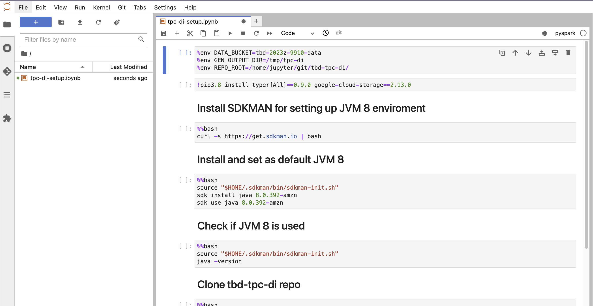

# TBD Project | 2023Z | Phase 2

> IMPORTANT ❗ ❗ ❗ Please remember to destroy all the resources after each work session. You can recreate infrastructure by creating new PR and merging it to master.
>
> 
>
> The goal of this phase is to create infrastructure, perform benchmarking/scalability tests of sample three-tier lakehouse solution and analyze the results using:
>
> * [TPC-DI benchmark](https://www.tpc.org/tpcdi/)
> * [dbt - data transformation tool](https://www.getdbt.com/)
> * [GCP Composer - managed Apache Airflow](https://cloud.google.com/composer?hl=pl)
> * [GCP Dataproc - managed Apache Spark](https://spark.apache.org/)
> * [GCP Vertex AI Workbench - managed JupyterLab](https://cloud.google.com/vertex-ai-notebooks?hl=pl)
>
> Worth to read:
>
> * <https://docs.getdbt.com/docs/introduction>
> * <https://airflow.apache.org/docs/apache-airflow/stable/index.html>
> * <https://spark.apache.org/docs/latest/api/python/index.html>
> * <https://medium.com/snowflake/loading-the-tpc-di-benchmark-dataset-into-snowflake-96011e2c26cf>
> * <https://www.databricks.com/blog/2023/04/14/how-we-performed-etl-one-billion-records-under-1-delta-live-tables.html>

# 1. Authors

## 1.1. Team

* Łukasz Staniszewski
* Albert Ściseł
* Mateusz Szczepanowski

## 1.2. Info

* Group number: 5
* Forked repo link: <https://github.com/thai-chicken/tbd-2023z-phase1>

# 2. Replace your root `main.tf`

> From the phase 1 with [main.tf](https://github.com/bdg-tbd/tbd-workshop-1/blob/v1.0.36/main.tf) and change each module `source` reference from the repo relative path to a github repo tag `v1.0.36`.

Changed file: [main.tf](https://github.com/thai-chicken/tbd-2023z-phase1/blob/master/main.tf)

# 3. Provision your infrastructure

>a) setup Vertex AI Workbench `pyspark` kernel as described in point [8](https://github.com/bdg-tbd/tbd-workshop-1/tree/v1.0.32#project-setup)
>
>
>b) upload [tpc-di-setup.ipynb](https://github.com/bdg-tbd/tbd-workshop-1/blob/v1.0.36/notebooks/tpc-di-setup.ipynb) to the running instance of your Vertex AI Workbench



# 4. In `tpc-di-setup.ipynb` modify cell under section ***Clone tbd-tpc-di repo***

> a) first, fork <https://github.com/mwiewior/tbd-tpc-di.git> to your github organization.
>
>
> b) create new branch (e.g. 'notebook') in your fork of tbd-tpc-di and modify profiles.yaml by commenting following lines:
>
> ```tf
> #"spark.driver.port": "30000"
> #"spark.blockManager.port": "30001"
> #"spark.driver.host": "10.11.0.5"  #FIXME: Result of the command (kubectl get nodes -o json |  jq -r '.items[0].status.addresses[0].address')
> #"spark.driver.bindAddress": "0.0.0.0"
> ```
>
> This lines are required to run dbt on airflow but have to be commented while running dbt in notebook.
>
>
> c) update git clone command to point to ***your fork***.

Forked repo link: <https://github.com/thai-chicken/tbd-2023z-phase1>

Link to the notebook: [tpc-di-setup.ipynb](https://github.com/thai-chicken/tbd-2023z-phase1/blob/master/notebooks/tpc-di-setup-dev.ipynb)

# 5. Access Vertex AI Workbench and run cell by cell notebook `tpc-di-setup.ipynb`

> a) in the first cell of the notebook replace: `%env DATA_BUCKET=tbd-2023z-9910-data` with your data bucket.
>
>
> b) in the cell:
>
> ```bash
> mkdir -p git && cd git
> git clone https://github.com/mwiewior/tbd-tpc-di.git
> cd tbd-tpc-di
> git pull
> ```
>
> replace repo with your fork. Next checkout to 'notebook' branch.
>
>
> c) after running first cells your fork of `tbd-tpc-di` repository will be cloned into Vertex AI  enviroment (see git folder).
>
>
> d) take a look on `git/tbd-tpc-di/profiles.yaml`. This file includes Spark parameters that can be changed if you need to increase the number of executors and
>
> ```tf
> server_side_parameters:
>    "spark.driver.memory": "2g"
>    "spark.executor.memory": "4g"
>    "spark.executor.instances": "2"
>    "spark.hadoop.hive.metastore.warehouse.dir": "hdfs:///user/hive/warehouse/"
> ```

As a result of running cell with `python3.8 tpcdi.py --output-directory $GEN_OUTPUT_DIR --stage $DATA_BUCKET` we had couple of tables created:

```bash
DATE table created.
DAILY_MARKET table created.
INDUSTRY table created.
PROSPECT table created.
CUSTOMER_MGMT table created.
TAX_RATE table created.
HR table created.
WATCH_HISTORY table created.
TRADE table created.
TRADE_HISTORY table created.
STATUS_TYPE table created.
TRADE_TYPE table created.
HOLDING_HISTORY table created.
CASH_TRANSACTION table created.
CMP table created.
SEC table created.
FIN table created.
```

As a result of running `dbt run` we got all the databases created:

```bash
20:46:34  Finished running 43 table models in 0 hours 18 minutes and 1.68 seconds (1081.68s).
20:46:34
20:46:34  Completed successfully
20:46:34
20:46:34  Done. PASS=43 WARN=0 ERROR=0 SKIP=0 TOTAL=43
```

As a result of running `dbt test` we got:

```bash
20:48:06  Finished running 1 test in 0 hours 1 minutes and 5.87 seconds (65.87s).
20:48:06  
20:48:06  Completed successfully
20:48:06  
20:48:06  Done. PASS=1 WARN=0 ERROR=0 SKIP=0 TOTAL=1
```

Using SQL commands we managed to see all the databases created:

```bash
+-----------+
|  namespace|
+-----------+
|     bronze|
|    default|
|demo_bronze|
|  demo_gold|
|demo_silver|
|      digen|
|       gold|
|     silver|
+-----------+
```

# 6. Explore files created by generator and describe them, including format, content, total size

Files created by a generator are in tbd-2023z-304098-data/tpc-di bucket.
There is 217 files of total size 960.2MiB in four types:
- 11 .txt files. With size between 89B for StatusType.txt to 295.2MiB for DailyMarket.txt. Five largest files in bucket are .txt files with size over 100MiB each. Files contain structured data, columns are separated using '|'. There is no headers in files and any other information about columns.
- 2 .csv files:
    -  Prospect.csv(10MiB) - It primarily contains personal data such as username, first name, surname and address. No header or information on the names of individual columns.
    -  HR.csv(3.9MiB) - It consists of 9 columns, just like the previous file without the header. It contains a column with id and, among other personal information: first name, last name and postal code.
- 1 CustomerMgmt.xml file(29.7MiB). Also includes personal data such as name, address and email addresses. When attempting to read the data by downloading it, we see that it is poorly structured, with rows and columns difficult to extract.
- 207 octet-stream files. All file names consist of the prefix FINWIRE and the period to which they relate (year and quarter). Size of files is between 57.6 KiB for FINWIRE1967Q3 to 968.4KiB for FINWIER2017Q3, there is a noticeable trend that the later the file refers to the larger it is. They contain mainly columns with numerical data, no information on column names, successive columns are separated using whitespace characters. The last rows in the files differ from the others and contain information about locations.

# 7. Analyze tpcdi.py. What happened in the loading stage?

Script processes and loads TPC-DI benchmark data into a data lakehouse environment. It consists of two main functions: `get_session` and `process_files`.

Function `get_session()` sets up a SparkSession with Hive support to handle SQL opeartions. Result of this function are four databases: `digen`, `bronze`, `silver` and `gold` created in Hive.

Function `process_files()` is core of the script and it processes several specific files with different formats and loads them into data lakehouse. It consists of sub-functions like: `get_stage_path()` (constructing the staging path), `save_df()` (saving dataframe as table), `upload_files()` (handles file upload to GCS bucket). Depending on file format/metadata, function processes it in different way:

* CSV and TXT are handled the same - schemas are created using `StructType` and `StructField` objects and then passed to `load_csv()` function (that loads .csv file into dataframe).
* XML is handled by SparkSession object to process hierarchical data.
* For FINWIRE `StructType` and `StructField` are used to enable reading the whole lines. Then fixed-width fields are handled and data extracted by processing separately different record types (`CMP`, `SEC` and `FIN`), each ending in separate Table.

While loading, the program estabilishes and manages dependencies using Ivy, then loads modules and creates the tables - it creates 43 table models. Whole process ends up completing successfully.

# 8. Using SparkSQL answer: how many table were created in each layer?

SparkSQL command:

```python
print(f"{'Layer':>15} | {'# Tables':>10}")
print("-"*16 + "+" + "-"*11)
for db_row in spark.sql("show databases").collect():
    db_name = db_row.namespace
    spark.sql(f"use {db_name}")
    n_tables = spark.sql("show tables").count()
    print(f"{db_name:>15} | {n_tables:>10}")
```

Result:

```tf
          Layer |   # Tables
----------------+-----------
         bronze |          0
        default |          0
    demo_bronze |         17
      demo_gold |         12
    demo_silver |         14
          digen |         17
           gold |          0
         silver |          0
```

# 9. Add some 3 more [dbt tests](https://docs.getdbt.com/docs/build/tests) and explain what you are testing. ***Add new tests to your repository.***

* Test 1 <br>

This SQL query tests for the presence of null values in the first_name and last_name columns of a table. It selects all records where either first_name or last_name is missing (i.e., is null).

The purpose of this test is to ensure data completeness, especially in cases where having both a first and last name is considered mandatory for each record in the table. 
```sql
SELECT *
FROM {{ ref('dim_broker') }} 
WHERE first_name IS NULL AND last_name IS NULL
```

* Test 2 <br>

This SQL code is a query designed to test data consistency in a table. It checks whether records marked as currently active (IS_CURRENT = true) have their end timestamp (end_timestamp) set to a specific value, which in this case is '9999-12-31 23:59:59.999'.

The '9999-12-31 23:59:59.999' value is often used in databases to represent an 'indefinite' or 'unspecified' end date, suggesting that the record is still active.
```sql
SELECT *
FROM {{ ref('dim_trade') }} 
WHERE is_current = true AND end_timestamp != '9999-12-31 23:59:59.999'
```

* Test 3 <br>

The purpose of this SQL test is to ensure data integrity in a table where there are two date fields: sk_date_placed and sk_date_removed. The test aims to verify that the sk_date_placed (the date an item was placed) is always earlier than or equal to sk_date_removed (the date the item was removed), under the condition where sk_date_removed is not null.
```sql
SELECT *
FROM {{ ref('fact_watches') }} 
WHERE sk_date_removed IS NOT NULL AND sk_date_placed > sk_date_removed
```

# 10. In main.tf update

```tf
dbt_git_repo            = "https://github.com/mwiewior/tbd-tpc-di.git"
dbt_git_repo_branch     = "main"
```

so dbt_git_repo points to your fork of tbd-tpc-di.

# 11. Redeploy infrastructure and check if the DAG finished with no errors

***The screenshot of Apache Aiflow UI***

> The goal of next tasks is to perform benchmarking/scalability tests of sample three-tier lakehouse solution.

# 12. In main.tf, change machine_type

> ```tf
> module "dataproc" {
>   depends_on   = [module.vpc]
>   source       = "github.com/bdg-tbd/tbd-workshop-1.git?ref=v1.0.36/modules/dataproc"
>   project_name = var.project_name
>   region       = var.region
>   subnet       = module.vpc.subnets[local.notebook_subnet_id].id
>   machine_type = "e2-standard-2"
> }
> ```
>
> and subsititute "e2-standard-2" with "e2-standard-4".

# 13. If needed request to increase cpu quotas (e.g. to 30 CPUs)

> [Link to console](https://console.cloud.google.com/apis/api/compute.googleapis.com/quotas?project=tbd-2023z-9918)

# 14. Different number of executors

> Using tbd-tpc-di notebook perform dbt run with different number of executors, i.e., 1, 2, and 5, by changing:
>
> ```tf
> "spark.executor.instances": "2"
> ```
>
>in profiles.yml.

# 15. Collect console output from dbt run

>In the notebook, collect console output from dbt run, then parse it and retrieve total execution time and execution times of processing each model. Save the results from each number of executors.

# 16. Analyze

> Analyze the performance and scalability of execution times of each model. Visualize and discucss the final results.
